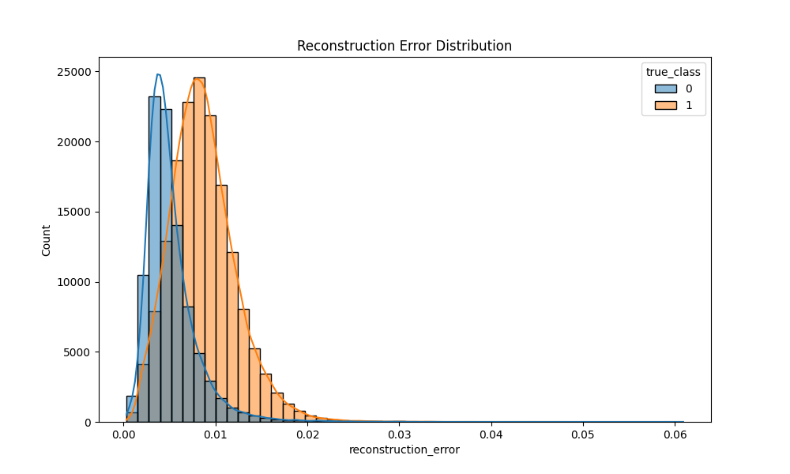
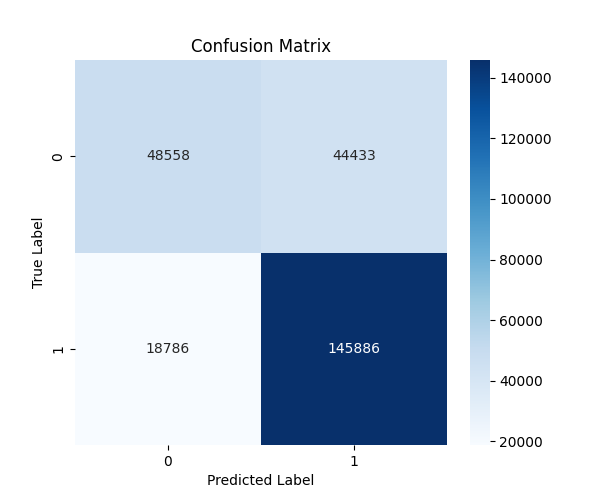
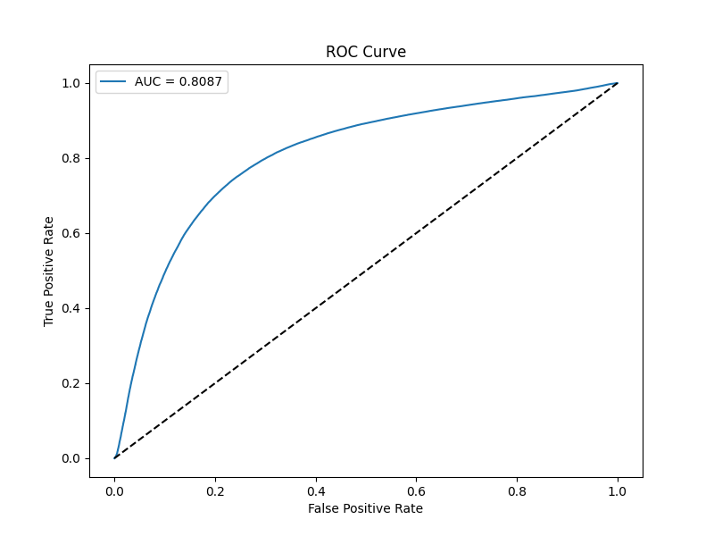

# Sequence-Level Intrusion Detection System

## Overview
This project implements a **Sequence-Level Intrusion Detection System** using a hybrid **1D-CNN + LSTM Autoencoder** architecture. The system is designed to detect anomalous or malicious network sessions by analyzing sequential patterns of network flows. It is trained on the **UNSW-NB15** dataset.

## Key Features
- **Hybrid Architecture**: Combines 1D-CNN for spatial feature extraction and LSTM for temporal dependency modeling.
- **Unsupervised/Semi-supervised Learning**: Trained only on normal traffic to learn a baseline of "normality".
- **Anomaly Detection**: Detects attacks by measuring the reconstruction error of network sequences.
- **Sequence Modeling**: Analyzes sequences of network flows (e.g., 10 consecutive flows) rather than isolated packets.

## Model Architecture
The model consists of two main parts:
1.  **Encoder**:
    -   **1D-CNN**: Extracts high-level features from the input sequence of flow attributes.
    -   **LSTM**: Compresses the temporal sequence into a fixed-size latent vector.
2.  **Decoder**:
    -   **LSTM**: Reconstructs the sequence from the latent vector.
    -   **TimeDistributed Dense**: Maps the LSTM output back to the original feature space.

## Results
The model achieves the following performance on the UNSW-NB15 test set:

- **ROC AUC**: **0.81**
- **F1 Score**: **0.82**
- **Precision**: **0.79**
- **Recall**: **0.85**

### Visualizations
| Reconstruction Error | Confusion Matrix | ROC Curve |
|:--------------------:|:----------------:|:---------:|
|  |  |  |

## Project Structure
```
├── data/               # Data directory (ignored in git)
├── dataset_kaggle/     # Raw dataset directory (ignored in git)
├── models/             # Saved models and evaluation plots
├── src/                # Source code
│   ├── data_preprocessing.py  # Data loading and processing
│   ├── model.py               # Model architecture definition
│   ├── train.py               # Training script
│   └── evaluate.py            # Evaluation and plotting script
├── requirements.txt    # Python dependencies
└── README.md           # Project documentation
```

## Getting Started

### Prerequisites
- Python 3.8+
- TensorFlow 2.x
- Pandas, NumPy, Scikit-learn, Matplotlib, Seaborn

### Installation
1.  Clone the repository:
    ```bash
    git clone https://github.com/yourusername/Intrusion-Detection-AI.git
    cd Intrusion-Detection-AI
    ```
2.  Install dependencies:
    ```bash
    pip install -r requirements.txt
    ```

### Data Setup
1.  Download the **UNSW-NB15** dataset from [Kaggle](https://www.kaggle.com/datasets/mrwellsdavid/unsw-nb15).
2.  Place the CSV files (`UNSW_NB15_training-set.csv`, `UNSW_NB15_testing-set.csv`) in a directory named `dataset_kaggle/` (or update the path in `src/data_preprocessing.py`).

### Usage
1.  **Train the Model**:
    ```bash
    python3 src/train.py
    ```
    This will train the autoencoder on normal traffic and save the model to `models/anomaly_detector.keras`.

2.  **Evaluate the Model**:
    ```bash
    python3 src/evaluate.py
    ```
    This will generate performance metrics and save plots to the `models/` directory.

## License
This project is licensed under the MIT License.
